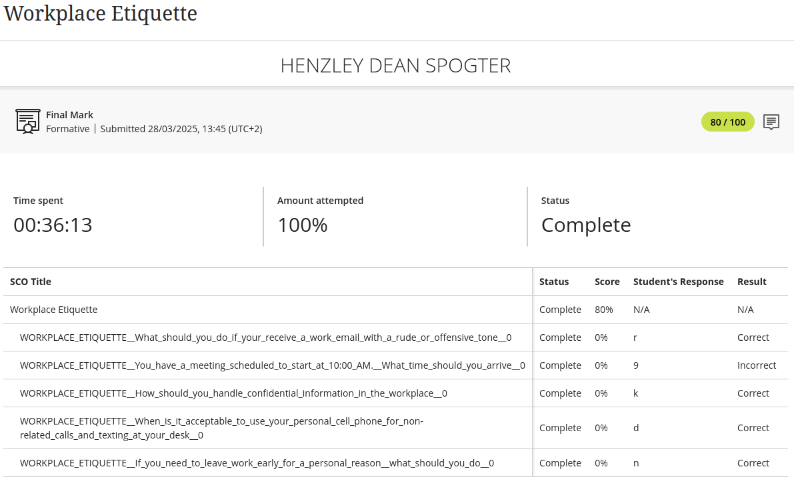

# Digital-Portfolio-2
The second part of the digital portfolio for PRP

# 1.Business Communication
## Evidence

**S**ituation - We were tasked with an assessment that taught me how to communicate in a professional manner in workplace environments.    

**T**ask - Completing the questions being presented during in between the content and making sure I understand what is being taught.  
 
**A**ction - To answer the questions being asked by referring to the content being presented. Applying the knowledge from the topics presented in the professional
workplace environment.
  
**R**esult - I got 100% for this assessment, which indicates that I have grasped the concepts being taught. Know I have to apply the knowledge in 
a professional environment.

# Interview skills
## Evidence

**S**tar - Having to complete an assessment that teaches how to successfully conduct interviews when applying for jobs.

**T**ask - Going through the content and answering the questions regarding the topics being presented. 

**A**ction - Completing the questions being asked and also applying the knowledge that I have learnt in real interviews when I am applying for jobs.

**R**esult - I scored 100% for this assessment, indicating that I have understood the content that I have been given. I also applied the knowledge when I was busy
applying for internships during my third year for WIL.

# Mock interview
## Evidence

**S**tar - I had to film myself conducting a mock interview to indicate that I have grasped the concepts being taught in the ***Interview skills*** assessment

**T**ask - Properly dressing up for and filming myself doing the mock interview. Answering the questions to the best of my ability that have been given to me.

**A**ction - Filming the mock interview and uploading it to github to the repository that has been created for us by the university.

**R**esult - I completed the mock interview and used it as practice for actual interviews that I landed for an internship position at software development companies.

# Professional Networking
## Evidence

**S**tar - Having to complete an assessment that teaches us how to properly network in order to create meaningful professional connections with other individuals in 
my field of study.

**T**ask - Going through the content and answering the questions that are there to test my knowledge of the concepts being taught.

**A**ction - Answering the questions to the best of my ability to prove that I have grasped the concepts being taught. 
Also applying the information at professional developer meet-ups and tech conferences that are held regularly in Cape Town.

**R**esult - I scored 80% for this assessment, which shows that I have a good understanding of the information that has been taught. 

# Workplace Etiquette
## EvidenceProfessional-Networking-proof

**S**tar - Having to complete an assessment that is aimed at teaching us how to conduct myself in a professional manner in the workplace.

**T**ask - Going through the information that was given and answering the questions given between the content that is there to test our knowledge of the information 
being taught.

**A**ction -

**R**esult - 
